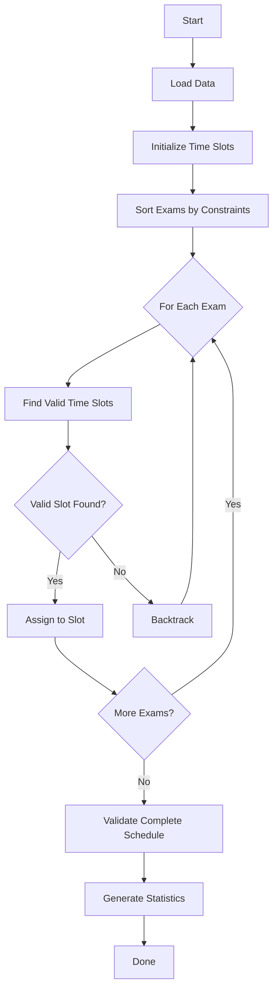

# 📅 Exam Scheduler System

<div align="center">


**A sophisticated JavaFX-based examination scheduling system that intelligently assigns exams to classrooms and time slots while respecting multiple constraints.**

[Features](#-features) • [Installation](#-installation) • [Usage](#-usage) • [Algorithm](#-scheduling-algorithm) • [Screenshots](#-screenshots) • [Contributing](#-contributing)

</div>

---

## 📋 Table of Contents

- [Overview](#-overview)
- [Key Features](#-features)
- [Technology Stack](#-technology-stack)
- [Project Structure](#-project-structure)
- [Installation](#-installation)
- [Usage Guide](#-usage)
- [Scheduling Algorithm](#-scheduling-algorithm)
- [Data Management](#-data-management)
- [Export Capabilities](#-export-capabilities)
- [Screenshots](#-screenshots)
- [Contributing](#-contributing)
- [License](#-license)

---

## 🎯 Overview

The **Exam Scheduler System** is a comprehensive desktop application designed to automate and optimize the complex process of examination scheduling in educational institutions. Built with JavaFX, it provides an intuitive interface for managing students, courses, classrooms, and generating conflict-free examination schedules.

### Why Exam Scheduler?

Traditional manual exam scheduling is:
- ⏰ **Time-consuming**: Hours of manual work reduced to minutes
- ❌ **Error-prone**: Human errors in conflict detection
- 📊 **Difficult to optimize**: Hard to balance resources efficiently
- 🔄 **Hard to modify**: Changes require complete rescheduling

Our system solves these problems with intelligent algorithms and real-time validation.

---

## ✨ Features

### 🎓 Core Functionality

- **Intelligent Scheduling**: Automated exam scheduling using advanced constraint satisfaction algorithms
- **Multi-Constraint Validation**: 
  - No student has overlapping exams
  - Maximum 2 exams per student per day
  - Classroom capacity constraints
  - Time slot availability
- **Real-time Conflict Detection**: Instant validation with detailed error reporting
- **Manual Schedule Editing**: Drag-and-drop interface for fine-tuning schedules

### 📊 Data Management

- **CSV Import/Export**: Easy data import from existing systems
- **Persistent Storage**: Save and load complete project states
- **Student Portal**: Dedicated view for students to see their personalized schedules
- **Course Enrollment**: Flexible student-course relationship management

### 📈 Analytics & Reporting

- **Comprehensive Statistics**: 
  - Total exams, students, and classrooms
  - Classroom utilization rates
  - Student workload distribution
- **Visual Calendar**: Interactive calendar view of the complete schedule
- **Export Options**:
  - PDF reports (main schedule)
  - Individual student schedules (consolidated PDF)
  - CSV exports for data analysis

### 🎨 User Experience

- **Modern UI**: Clean, professional interface with dark/light theme support
- **Responsive Design**: Adaptive layout for different screen sizes
- **Tooltips & Help**: Context-sensitive help throughout the application
- **Progress Tracking**: Real-time feedback during long operations

---

## 🛠️ Technology Stack

| Component | Technology | Version |
|-----------|-----------|---------|
| **Language** | Java | 11+ |
| **UI Framework** | JavaFX | 21.0.1 |
| **Build Tool** | Maven | 3.8+ |
| **PDF Generation** | iText | 5.5.13.3 |
| **Data Format** | CSV | - |

### Dependencies

```xml
<dependencies>
    <!-- JavaFX Controls -->
    <dependency>
        <groupId>org.openjfx</groupId>
        <artifactId>javafx-controls</artifactId>
        <version>21.0.1</version>
    </dependency>
    
    <!-- JavaFX FXML -->
    <dependency>
        <groupId>org.openjfx</groupId>
        <artifactId>javafx-fxml</artifactId>
        <version>21.0.1</version>
    </dependency>
    
    <!-- iText PDF -->
    <dependency>
        <groupId>com.itextpdf</groupId>
        <artifactId>itextpdf</artifactId>
        <version>5.5.13.3</version>
    </dependency>
</dependencies>
```

---

## 📁 Project Structure

```
SE302/
├── src/
│   └── main/
│       └── java/
│           └── com/examscheduler/
│               ├── logic/
│               │   ├── CSVParser.java          # CSV data import/export
│               │   └── DataManager.java        # Singleton data manager
│               ├── model/
│               │   ├── Classroom.java          # Classroom entity
│               │   ├── Course.java             # Course entity
│               │   ├── Exam.java               # Exam entity
│               │   ├── Schedule.java           # Schedule container
│               │   ├── Student.java            # Student entity
│               │   └── TimeSlot.java           # Time slot entity
│               └── ui/
│                   ├── ExamSchedulerApp.java   # Main application
│                   └── ThemeManager.java       # Theme management
├── pom.xml                                     # Maven configuration
└── README.md                                   # This file
```

### Architecture Highlights

- **MVC Pattern**: Clear separation between model, view, and logic
- **Singleton Pattern**: Centralized data management via `DataManager`
- **Observer Pattern**: Real-time UI updates on data changes
- **Factory Pattern**: Dynamic UI component generation

---

## 🚀 Installation

### Prerequisites

Ensure you have the following installed:

- ☕ **Java Development Kit (JDK) 11 or higher**
  ```bash
  java -version  # Should show 11 or higher
  ```

- 📦 **Apache Maven 3.8 or higher**
  ```bash
  mvn -version
  ```

### Step-by-Step Installation

1. **Clone the Repository**
   ```bash
   git clone <repository-url>
   cd SE302-18Aralık
   ```

2. **Build the Project**
   ```bash
   mvn clean install
   ```
   This will:
   - Download all dependencies
   - Compile the source code
   - Run tests (if configured)
   - Create the executable JAR

3. **Run the Application**
   ```bash
   mvn javafx:run
   ```

### Alternative: Run from IDE

1. Import the project as a Maven project in your IDE (IntelliJ IDEA, Eclipse, NetBeans)
2. Configure the main class: `com.examscheduler.App`
3. Run the application

---

## 📖 Usage

### Getting Started

#### 1. Welcome Screen

When you first launch the application, you'll see a modern welcome screen with options to:
- 📂 **Start New Project**: Begin with a fresh project
- 📁 **Load Existing Project**: Continue from a saved state
- ⚙️ **Settings**: Configure application preferences


*The welcome screen provides quick access to all main features*

---

#### 2. Import Data

To schedule exams, you need to import data via CSV files:

**Required CSV Files:**
- `students.csv` - Student information
  ```csv
  StudentID,Name
  S001,John Doe
  S002,Jane Smith
  ```

- `courses.csv` - Course information
  ```csv
  CourseCode,CourseName,EnrolledCount
  CS101,Introduction to Computer Science,50
  MATH201,Calculus II,35
  ```

- `classrooms.csv` - Classroom information
  ```csv
  ClassroomID,Capacity
  A101,50
  B205,30
  ```

- `attendance.csv` - Student-course enrollments
  ```csv
  StudentID,CourseCode
  S001,CS101
  S001,MATH201
  S002,CS101
  ```

**Import Process:**
1. Click **"📥 Import Data"** from the toolbar
2. Select all four CSV files
3. Review the import summary
4. Click **"Import"** to load the data


*Import dialog showing file selection and validation*

---

#### 3. Configure Schedule Parameters

Before generating the schedule, set the following parameters:

- **📅 Exam Start Date**: First day of the exam period
- **📆 Exam Day Period**: Total number of days for the examination period
- **⏰ Time Slots**: The exam hours.

These parameters determine the available time slots for scheduling.


*Configure exam period duration and time slots*

---

#### 4. Generate Schedule

Click the **"⚡ Generate Schedule"** button to:
1. Analyze all constraints
2. Run the scheduling algorithm
3. Assign exams to classrooms and time slots
4. Validate the complete schedule

The system provides real-time progress updates during generation.

**Validation Results:**
- ✅ **Critical Issues**: Must be resolved (e.g., capacity violations)
- ⚠️ **Warnings**: Should be reviewed (e.g., student workload)
- ℹ️ **Info**: General statistics and analysis


*Live progress during schedule generation with validation results*

---

#### 5. Review & Edit Schedule

After generation, you can:

- **📊 View by Day**: See all exams for each day
- **🏫 View by Classroom**: Check classroom utilization
- **👨‍🎓 View by Student**: See individual student schedules
- **✏️ Manual Edits**: Drag and drop exams to different slots (with automatic validation)


*Main schedule view with filtering and editing capabilities*

---

#### 6. Student Portal

Students can view their personalized exam schedule:

1. Click **"👥 Student Portal"** from the toolbar
2. Search for a student by ID or name
3. View their schedule in multiple formats:
   - 📅 **Dashboard**: Overview with upcoming exams
   - 🗓️ **Calendar**: Visual timeline
   - 📈 **Statistics**: Exam distribution analysis


*Student portal showing personalized schedule and statistics*

---

#### 7. Export & Reports

Generate professional reports:

**PDF Reports:**
- 📄 **Main Schedule**: Complete schedule for administrators
- 👤 **Student Schedules**: Individual PDFs for each student (consolidated)

**CSV Exports:**
- 📊 **Schedule Data**: For further analysis or integration
- 📋 **Statistics**: Detailed metrics and analytics

All exports include:
- Comprehensive statistics
- Visual charts (PDF only)
- Conflict analysis
- Utilization metrics


*Export dialog with multiple format options*

---

## 🧮 Scheduling Algorithm

The Exam Scheduler uses a **Constraint Satisfaction Problem (CSP)** approach with intelligent heuristics to generate optimal schedules.

### Algorithm Overview



### Constraint Resolution

The algorithm enforces the following hard and soft constraints:

#### Hard Constraints (Must be satisfied)
1. **No Student Overlap**: A student cannot have two exams at the same time
2. **Classroom Capacity**: Number of enrolled students ≤ classroom capacity
3. **Time Slot Availability**: Each exam-classroom pair must have an available time slot

#### Soft Constraints (Optimized when possible)
1. **Student Workload**: Prefer ≤2 exams per student per day
2. **Classroom Utilization**: Balance usage across all classrooms
3. **Exam Distribution**: Spread exams evenly across the schedule period

### Optimization Heuristics

1. **Most Constrained First**: Schedule exams with the most students first
2. **Least Available Options**: Prioritize exams with fewer valid time slots
3. **Forward Checking**: Eliminate invalid future options early
4. **Backtracking**: Undo assignments when contradictions are detected

### Performance

- **Small Datasets** (< 50 exams): < 1 second
- **Medium Datasets** (50-200 exams): 1-10 seconds  
- **Large Datasets** (200+ exams): 10-60 seconds

Performance depends on:
- Number of constraints
- Classroom availability
- Student enrollment patterns
- Time slot configuration

---

## 💾 Data Management

### DataManager (Singleton)

The `DataManager` class serves as the central hub for all data operations:

```java
DataManager manager = DataManager.getInstance();

// Access data
List<Student> students = manager.getStudents();
List<Course> courses = manager.getCourses();
Schedule schedule = manager.getSchedule();

// O(1) lookups using HashMaps
Student student = manager.getStudentByID("S001");
Course course = manager.getCourseByCode("CS101");
Classroom classroom = manager.getClassroomByID("A101");
```

### Features

- **Singleton Pattern**: Ensures single source of truth
- **HashMap Indexing**: O(1) lookup by ID/code
- **Automatic CSV Sync**: Changes automatically written back to CSV files
- **Serialization**: Save/load complete project states
- **Validation**: Built-in data integrity checks

### CSV Format Requirements

All CSV files must:
- Use UTF-8 encoding
- Have headers in the first row
- Use comma (`,`) as delimiter
- Contain no empty lines

---

## 📤 Export Capabilities

### PDF Exports

Generated PDF reports include:

1. **Cover Page**: Institution name, exam period, generation date
2. **Statistics Dashboard**:
   - Total exams, students, classrooms
   - Classroom utilization chart
   - Student workload distribution
3. **Complete Schedule**: Day-by-day breakdown
4. **Conflict Analysis**: Warnings and validation results

### CSV Exports

CSV exports include:
- Exam code, course name, date, time, classroom
- Student list per exam
- Metadata (generation timestamp, parameters)

### Student PDFs

Individual student schedules contain:
- Personal information
- Exam calendar
- Detailed exam list (time, location, course)
- Preparation timeline

---

## 📸 Screenshots

### Main Application Views

<table>
<tr>
<td width="50%">


*Main dashboard with key statistics*

</td>
</tr>
</table>


<table>

</table>

### Advanced Features

<table>
<tr>
<td width="50%">


*Detailed validation results with conflict detection*

</td>
<td width="50%">


*Comprehensive analytics and statistics*

</td>
</tr>
</table>


---

## 🤝 Contributing

Contributions are welcome! Here's how you can help:

### Ways to Contribute

1. 🐛 **Report Bugs**: Open an issue with detailed reproduction steps
2. 💡 **Suggest Features**: Propose new features or improvements
3. 📝 **Improve Documentation**: Fix typos, add examples, clarify instructions
4. 🔧 **Submit Pull Requests**: Fix bugs or implement features

### Development Workflow

1. Fork the repository
2. Create a feature branch: `git checkout -b feature/amazing-feature`
3. Make your changes with clear, descriptive commits
4. Test thoroughly
5. Push to your fork: `git push origin feature/amazing-feature`
6. Open a Pull Request

### Code Style Guidelines

- Follow Java naming conventions
- Add JavaDoc comments for public methods
- Keep methods focused and under 50 lines when possible
- Write descriptive commit messages
- Include inline comments for complex logic

### Testing

Before submitting a PR:
- ✅ Test with sample CSV data
- ✅ Verify no regression in existing features
- ✅ Check UI responsiveness
- ✅ Test on different operating systems (if possible)

---

## 📄 License


```


Copyright (c) 2025 Exam Scheduler Team

Permission is hereby granted, free of charge, to any person obtaining a copy
of this software and associated documentation files (the "Software"), to deal
in the Software without restriction, including without limitation the rights
to use, copy, modify, merge, publish, distribute, sublicense, and/or sell
copies of the Software, and to permit persons to whom the Software is
furnished to do so, subject to the following conditions:

The above copyright notice and this permission notice shall be included in all
copies or substantial portions of the Software.

THE SOFTWARE IS PROVIDED "AS IS", WITHOUT WARRANTY OF ANY KIND, EXPRESS OR
IMPLIED, INCLUDING BUT NOT LIMITED TO THE WARRANTIES OF MERCHANTABILITY,
FITNESS FOR A PARTICULAR PURPOSE AND NONINFRINGEMENT. IN NO EVENT SHALL THE
AUTHORS OR COPYRIGHT HOLDERS BE LIABLE FOR ANY CLAIM, DAMAGES OR OTHER
LIABILITY, WHETHER IN AN ACTION OF CONTRACT, TORT OR OTHERWISE, ARISING FROM,
OUT OF OR IN CONNECTION WITH THE SOFTWARE OR THE USE OR OTHER DEALINGS IN THE
SOFTWARE.
```

---

## 🙏 Acknowledgments

Thanks for all help for all members.Furkan,Ali,Ahmet Emir, Can and Abdulhamid.

---

## 📧 Contact & Support

- **Issues**: [GitHub Issues](https://github.com/your-repo/issues)
- **Discussions**: [GitHub Discussions](https://github.com/your-repo/discussions)
- **Email**: abdulhamidyildirim@hotmail.com

---

<div align="center">

**Made with by the Exam Scheduler Team**

⭐ Star this repository if you find it helpful!

</div>
